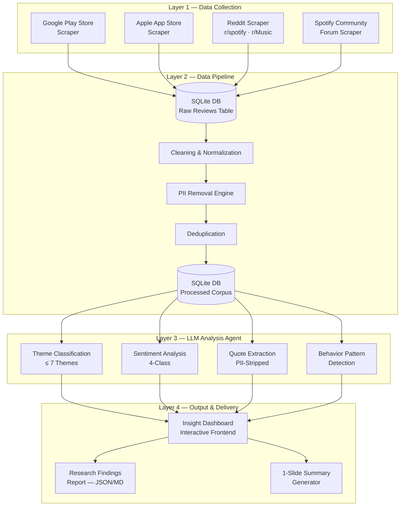
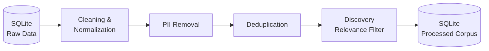
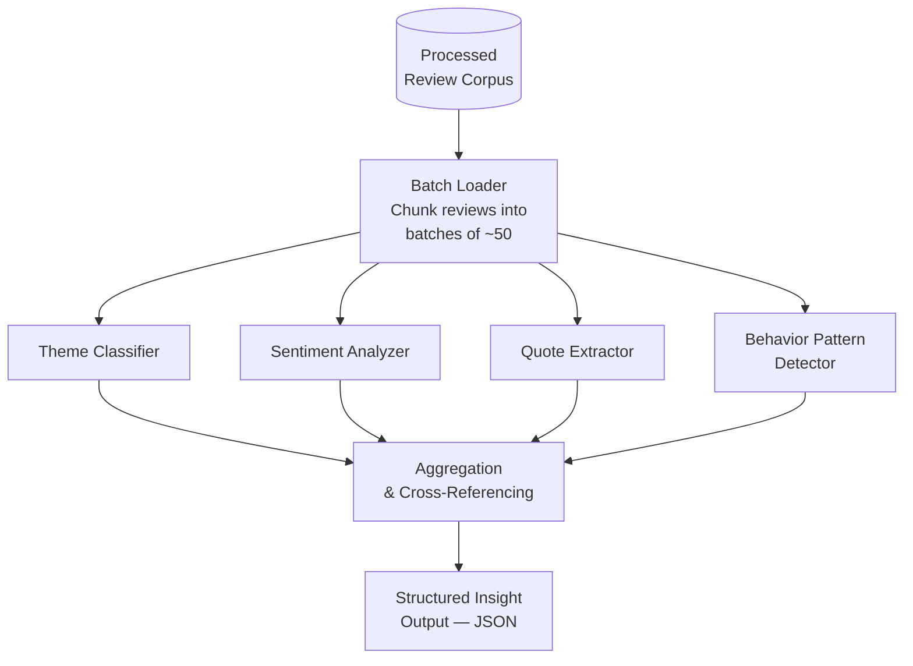
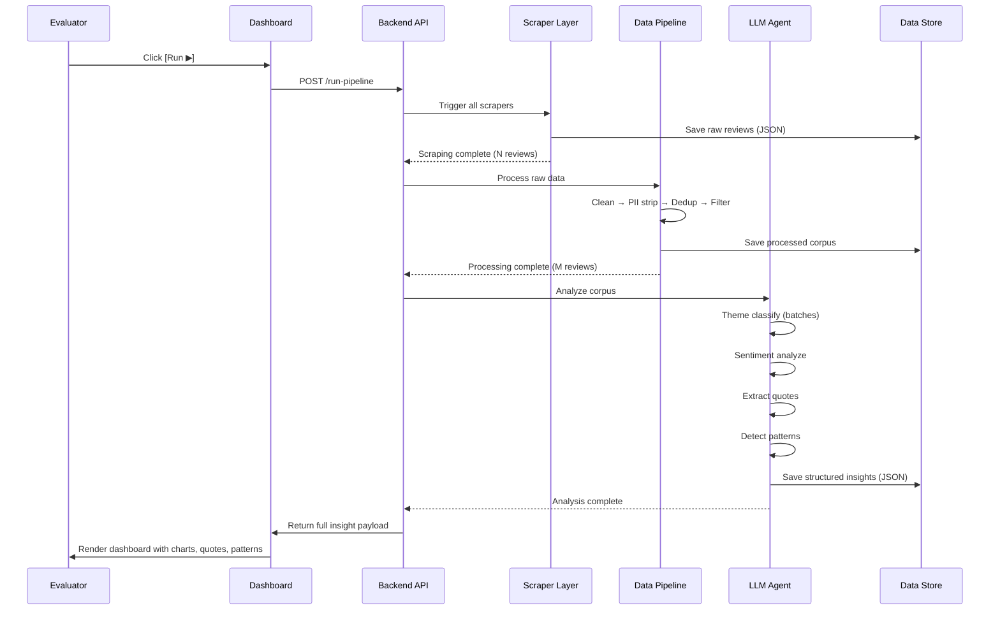
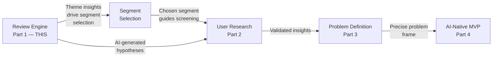

# 🏗️ Architecture — AI-Powered Review Discovery Engine

> **Scope:** This document covers the technical architecture for **Part 1** of the graduation project — the AI-powered review analysis system that ingests, processes, and surfaces actionable insights about Spotify's music discovery problem.
>
> **Reference:** [Problem Statement](problemstatement.md) — §5

---

## 1. High-Level System Overview



---

## 2. Layer 1 — Data Collection

### 2.1 Sources & Scraping Strategy

Each source is handled by a dedicated scraper module. The goal is to collect reviews from **at least 3 sources** (per problem statement §5.4), with a focus on **recency** (Q1–Q2 2026 data is highest priority).

| Source | Method | Target Data | Volume Target |
|---|---|---|---|
| **Google Play Store** | `google-play-scraper` (Node.js) or `google_play_scraper` (Python) | Rating, title, text, date, thumbsUp count | 2,000–5,000 reviews |
| **Apple App Store** | `app-store-scraper` (Node.js) or App Store RSS feed | Rating, title, text, date | 1,000–3,000 reviews |
| **Reddit** | PRAW (Python Reddit API Wrapper) or Reddit JSON API | Post title, body, comments, subreddit, score, date | 500–1,500 posts + top comments |
| **Spotify Community** | HTTP scraper (BeautifulSoup / Playwright) | Thread title, body, replies, kudos, labels | 300–800 threads |

### 2.2 Scraper Module Design

Each scraper follows a common interface:

```
┌─────────────────────────────────────────┐
│  BaseScraper (Abstract)                 │
│─────────────────────────────────────────│
│  + source_name: str                     │
│  + fetch(query, filters) → RawReview[]  │
│  + paginate(cursor) → RawReview[]       │
│  + save_raw(data, path) → void          │
│  + get_metadata() → SourceMetadata      │
└─────────────────────────────────────────┘
         ▲         ▲         ▲         ▲
         │         │         │         │
   PlayStore  AppStore   Reddit   Community
    Scraper    Scraper   Scraper   Scraper
```

### 2.3 Raw Review Schema

All scrapers normalize output into a unified raw schema before passing to the pipeline:

```json
{
  "id": "unique-review-id",
  "source": "play_store | app_store | reddit | community",
  "rating": 3,
  "title": "Discovery feels broken",
  "text": "I keep getting the same songs recommended...",
  "date": "2026-04-15",
  "metadata": {
    "thumbs_up": 42,
    "subreddit": "r/spotify",
    "reply_count": 12
  }
}
```

---

## 3. Layer 2 — Data Pipeline

### 3.1 Pipeline Steps



### 3.2 Step Details

#### 3.2.1 Cleaning & Normalization
- Strip HTML tags, emojis-to-text conversion, Unicode normalization
- Standardize date formats to ISO 8601
- Normalize ratings to a 1–5 scale across all sources (Reddit posts use score bins)
- Discard reviews with empty/null text body
- Language detection → retain English-only reviews (or primary target language)

#### 3.2.2 PII Removal
- **Regex-based:** Strip email addresses, phone numbers, URLs with user identifiers
- **NER-based:** Use a lightweight NER model (spaCy `en_core_web_sm`) to detect and redact person names, account IDs, device identifiers
- **Validation pass:** Flag any remaining potential PII for manual spot-check
- **Zero PII tolerance** — any review that cannot be confidently stripped is excluded

#### 3.2.3 Deduplication
- Exact match on `(source, text_hash)` → remove identical cross-posts
- Fuzzy dedup using MinHash / Jaccard similarity (threshold ≥ 0.85) → collapse near-duplicates, keep the version with the highest engagement

#### 3.2.4 Discovery Relevance Filter
- **Keyword pre-filter:** Reviews must contain at least one discovery-related term from a curated lexicon (e.g., *discover, recommend, suggest, new music, same songs, repeat, boring, stale, playlist, algorithm, Discover Weekly, Release Radar, explore*)
- **LLM relevance check (optional):** For borderline reviews, a quick binary classification pass: "Is this review about music discovery or recommendation quality?"
- This step reduces noise from reviews about unrelated topics (payments, UI bugs, account issues)

### 3.3 Processed Corpus Schema

```json
{
  "id": "processed-review-id",
  "source": "play_store",
  "rating": 2,
  "text": "[PII-STRIPPED] I've been using Spotify for 3 years and Discover Weekly keeps giving me the same kind of indie pop...",
  "date": "2026-05-02",
  "word_count": 47,
  "discovery_keywords": ["Discover Weekly", "same kind"],
  "engagement_score": 42
}
```

---

## 4. Layer 3 — LLM Analysis Agent

### 4.1 Agent Architecture

The analysis agent is the core intelligence layer. It processes the cleaned corpus through four parallel analysis tasks and produces structured output.



### 4.2 LLM Selection & Configuration

| Parameter | Value |
|---|---|
| **Primary Model** | Llama 3 70B (via Groq API) |
| **Fallback Model** | Mixtral 8x7B (via Groq API) for high-volume, simpler tasks |
| **Temperature** | 0.2 (low — we need deterministic, analytical output) |
| **Max Tokens** | Varies by task (classification: 200, quotes: 500, patterns: 1000) |
| **System Prompt Strategy** | Task-specific system prompts per analysis module (see §4.3) |

### 4.3 Analysis Modules

#### 4.3.1 Theme Classification (≤ 7 Themes)

**Input:** Batch of 50 cleaned reviews
**Output:** Each review tagged with 1–2 themes from a controlled taxonomy

**Controlled Theme Taxonomy:**

| Theme ID | Theme | Description |
|---|---|---|
| `T1` | Algorithm Staleness | Recommendations feel repetitive, predictable, stuck in a loop |
| `T2` | Genre Bubble | Unable to break out of a narrow genre/artist cluster |
| `T3` | Skip Fatigue | High skip rate on recommended tracks → loss of trust |
| `T4` | Context Mismatch | Recommendations don't match the current mood, activity, or setting |
| `T5` | Playlist Decay | Curated playlists (Discover Weekly, Daily Mix) decline in quality over time |
| `T6` | Feature Gap | Missing tools for active/intentional exploration |
| `T7` | Exploration Fatigue | Users want to discover but give up due to effort required |

**Prompt Pattern:**
```
You are a music streaming product analyst. Classify each review into 1–2 themes
from the following taxonomy: [T1–T7 definitions].

For each review, return:
- theme_ids: [list of 1-2 theme IDs]
- confidence: float (0.0–1.0)

If a review does not match any theme, tag it as "T0: Out of Scope".
Respond in JSON only.
```

#### 4.3.2 Sentiment Analysis (4-Class)

**Classes:** `positive` | `neutral` | `negative` | `frustrated`

The `frustrated` class is distinct from `negative` — it captures reviews where the user explicitly expresses intent to leave, switch platforms, or has tried and failed to solve the problem themselves.

**Output per review:**
```json
{
  "sentiment": "frustrated",
  "confidence": 0.91,
  "signal_phrases": ["I've tried everything", "giving up on Discover Weekly"]
}
```

#### 4.3.3 Quote Extraction

For each theme, surface the **3–5 most representative user quotes** that:
- Are PII-free
- Clearly articulate the pain point
- Come from high-engagement reviews (high thumbs-up / score)
- Vary across sources (don't over-index on one platform)

**Output:**
```json
{
  "theme": "T2 — Genre Bubble",
  "quotes": [
    {
      "text": "I listen to one jazz playlist and now Spotify thinks I only want jazz forever...",
      "source": "reddit",
      "rating": null,
      "engagement": 187
    }
  ]
}
```

#### 4.3.4 Behavior Pattern Detection

This module looks across the corpus for recurring **user behavior patterns** — not individual reviews but aggregate signals that reveal *how users behave* around discovery:

- **Workaround Patterns:** Users describing manual workarounds (creating burner accounts, using YouTube to discover then switching to Spotify, asking friends)
- **Abandonment Triggers:** Specific events that cause users to stop trying to discover
- **Platform Comparison Signals:** References to competitor discovery features (Apple Music stations, YouTube autoplay, TikTok → Spotify pipeline)
- **Power-User vs. Casual Split:** Different discovery frustrations across listening intensity levels

---

## 5. Layer 4 — Output & Delivery

### 5.1 Insight Dashboard (Primary Deliverable)

An interactive frontend where the evaluator can:

1. **Trigger the full pipeline** — initiate scraping → processing → analysis
2. **View theme distribution** — bar/pie chart showing review volume per theme
3. **Explore sentiment breakdown** — per-theme sentiment distribution (stacked bar)
4. **Read representative quotes** — filterable by theme, source, and sentiment
5. **See behavior patterns** — narrative summary of detected user behavior signals
6. **View meta-stats** — total reviews processed, source breakdown, date range, processing time

### 5.2 Dashboard Wireframe

```
┌──────────────────────────────────────────────────────────────────┐
│  🎵 Spotify Review Discovery Engine                    [Run ▶]  │
├──────────────────────────────────────────────────────────────────┤
│                                                                  │
│  ┌─── Summary Stats ────────────────────────────────────────┐   │
│  │ Reviews: 4,231  │ Sources: 4  │ Date Range: Jan–Jun 2026 │   │
│  └──────────────────────────────────────────────────────────┘   │
│                                                                  │
│  ┌─── Theme Distribution ─────┐  ┌─── Sentiment Overview ───┐  │
│  │  ████████ T1 Staleness 28% │  │  ■ Positive    12%       │  │
│  │  ██████   T2 Genre Bub 22% │  │  ■ Neutral     18%       │  │
│  │  █████    T5 Pl. Decay 18% │  │  ■ Negative    41%       │  │
│  │  ████     T3 Skip Fat  14% │  │  ■ Frustrated  29%       │  │
│  │  ███      T7 Expl. Fat 10% │  └──────────────────────────┘  │
│  │  ██       T4 Ctx Mism   5% │                                 │
│  │  █        T6 Feat Gap   3% │                                 │
│  └────────────────────────────┘                                 │
│                                                                  │
│  ┌─── Top Quotes by Theme ──────────────────────────────────┐   │
│  │ [T1 ▼]  "Discover Weekly used to surprise me, now it's   │   │
│  │          just the same 5 artists on rotation..."          │   │
│  │          — Play Store ★★☆☆☆  │  👍 94                    │   │
│  │                                                           │   │
│  │  "I've been a premium user for 4 years and the algorithm  │   │
│  │   has completely stagnated..."                             │   │
│  │          — Reddit r/spotify  │  ↑ 312                     │   │
│  └───────────────────────────────────────────────────────────┘   │
│                                                                  │
│  ┌─── Behavior Patterns ────────────────────────────────────┐   │
│  │ 🔄 Workarounds: 23% of frustrated users report using     │   │
│  │    external platforms (TikTok, YouTube) to discover then  │   │
│  │    manually searching on Spotify                          │   │
│  │                                                           │   │
│  │ 🚪 Abandonment: Common trigger — 3+ consecutive weeks    │   │
│  │    of irrelevant Discover Weekly → user stops checking    │   │
│  └───────────────────────────────────────────────────────────┘   │
│                                                                  │
│  ┌─── Key Research Questions Answered ──────────────────────┐   │
│  │ ✅ Why do users struggle to discover new music?           │   │
│  │ ✅ Most common recommendation frustrations?               │   │
│  │ ✅ What listening behaviors are users trying to achieve?   │   │
│  │ ✅ What causes repetitive listening loops?                 │   │
│  │ ✅ Which segments face different challenges?               │   │
│  │ ✅ What unmet needs emerge consistently?                   │   │
│  └───────────────────────────────────────────────────────────┘   │
└──────────────────────────────────────────────────────────────────┘
```

### 5.3 Research Findings Report

Auto-generated structured output (JSON + Markdown) summarizing:

```json
{
  "meta": {
    "total_reviews": 4231,
    "sources": ["play_store", "app_store", "reddit", "community"],
    "date_range": "2026-01-01 to 2026-06-15",
    "processing_time_seconds": 342
  },
  "themes": [
    {
      "id": "T1",
      "name": "Algorithm Staleness",
      "review_count": 1185,
      "percentage": 28.0,
      "sentiment_breakdown": {
        "positive": 0.03,
        "neutral": 0.10,
        "negative": 0.48,
        "frustrated": 0.39
      },
      "top_quotes": ["..."],
      "actionable_insight": "Users perceive a decay in recommendation novelty over time..."
    }
  ],
  "behavior_patterns": ["..."],
  "segment_signals": ["..."],
  "key_findings_summary": "..."
}
```

---

## 6. Tech Stack

| Layer | Technology | Rationale |
|---|---|---|
| **Scrapers** | Python 3.11+ | Ecosystem maturity for scraping (BeautifulSoup, PRAW, app-store-scraper ports) |
| **Play Store Scraper** | `google-play-scraper` (Python) | Lightweight, no API key needed |
| **App Store Scraper** | `app-store-scraper` or iTunes RSS | Public data, structured output |
| **Reddit Scraper** | PRAW + Reddit JSON API | Official API access, respects rate limits |
| **Community Scraper** | BeautifulSoup + requests / Playwright | Spotify Community is HTML-based, no public API |
| **Database Architecture** | SQLite | Zero-cost, file-based, serverless, natively supported in Python. Perfect for handling a few thousand reviews without the overhead of PostgreSQL/MongoDB. |
| **Data Pipeline** | Python (pandas, spaCy) | Cleaning, normalization, NER for PII removal |
| **LLM Integration** | Groq API (Llama 3 / Mixtral models) | Extremely fast inference, generous free tier (zero cost), perfect for batch processing analysis tasks. |
| **Frontend Dashboard** | HTML + Vanilla CSS + JavaScript | Lightweight, deployable, no build tooling overhead |
| **Deployment** | Vercel (frontend) + Railway/Render (Python backend) | Free tier available, easy deploy-to-production |
| **Data Format** | JSON (primary), CSV (raw export) | Interoperable, inspectable, version-controllable |

---

## 7. Project Structure

```
graduation-project/
├── Docs/
│   ├── problemstatement.md
│   ├── architecture.md          ← This document
│   └── GRADUATION PROJECT.md.md
│
├── review-engine/
│   ├── scrapers/
│   │   ├── base_scraper.py      # Abstract base class
│   │   ├── playstore_scraper.py
│   │   ├── appstore_scraper.py
│   │   ├── reddit_scraper.py
│   │   └── community_scraper.py
│   │
│   ├── pipeline/
│   │   ├── cleaner.py           # Text cleaning & normalization
│   │   ├── pii_remover.py       # PII detection & redaction
│   │   ├── deduplicator.py      # Exact + fuzzy dedup
│   │   └── relevance_filter.py  # Discovery keyword filtering
│   │
│   ├── agent/
│   │   ├── analyzer.py          # Main LLM analysis orchestrator
│   │   ├── theme_classifier.py  # Theme tagging module
│   │   ├── sentiment.py         # 4-class sentiment analysis
│   │   ├── quote_extractor.py   # Representative quote selection
│   │   ├── pattern_detector.py  # Behavior pattern analysis
│   │   └── prompts/
│   │       ├── theme_prompt.txt
│   │       ├── sentiment_prompt.txt
│   │       ├── quote_prompt.txt
│   │       └── pattern_prompt.txt
│   │
│   ├── output/
│   │   ├── report_generator.py  # JSON + MD report builder
│   │   └── templates/
│   │       └── findings_template.md
│   │
│   ├── data/
│   │   ├── database.sqlite      # SQLite DB (raw & processed tables)
│   │   └── lexicon/
│   │       └── discovery_keywords.json
│   │
│   ├── config.py                # API keys, source configs, thresholds
│   ├── main.py                  # Entry point — orchestrates full pipeline
│   └── requirements.txt
│
├── dashboard/
│   ├── index.html
│   ├── index.css
│   ├── app.js                   # Frontend logic — fetch & render insights
│   └── api/
│       └── server.py            # Lightweight Flask/FastAPI backend
│
├── .env                         # API keys (gitignored)
├── .gitignore
└── README.md
```

---

## 8. Execution Flow



---

## 9. API Endpoints

| Method | Endpoint | Description |
|---|---|---|
| `POST` | `/api/run-pipeline` | Triggers full scrape → process → analyze pipeline |
| `GET` | `/api/status` | Returns current pipeline status (idle / scraping / processing / analyzing / complete) |
| `GET` | `/api/insights` | Returns the latest structured insight JSON |
| `GET` | `/api/insights/themes` | Returns theme distribution data |
| `GET` | `/api/insights/sentiment` | Returns sentiment breakdown by theme |
| `GET` | `/api/insights/quotes?theme=T1` | Returns representative quotes for a specific theme |
| `GET` | `/api/insights/patterns` | Returns detected behavior patterns |
| `GET` | `/api/meta` | Returns corpus metadata (review count, sources, date range) |

---

## 10. Key Constraints & Guardrails

| Constraint | Implementation |
|---|---|
| **Public data only** | All scrapers use publicly accessible endpoints — no authenticated APIs or login-walled content |
| **Zero PII leakage** | Dual-pass PII removal (regex + NER) with a validation layer; reviews failing PII check are excluded entirely |
| **Theme cap ≤ 7** | Controlled taxonomy defined upfront; LLM cannot create new themes outside T1–T7 |
| **Testable end-to-end** | Dashboard has a Run button that triggers the full pipeline; evaluator can observe each stage |
| **Rate limit compliance** | Scrapers implement exponential backoff and respect platform-specific rate limits |
| **Reproducibility** | All raw and processed data is saved; pipeline can be re-run on cached data without re-scraping |

---

## 11. What This Architecture Feeds Into

The review engine's output directly enables the subsequent project phases:



The review engine is not a standalone deliverable — it is the **research foundation** that makes every downstream decision evidence-backed rather than assumption-driven.
