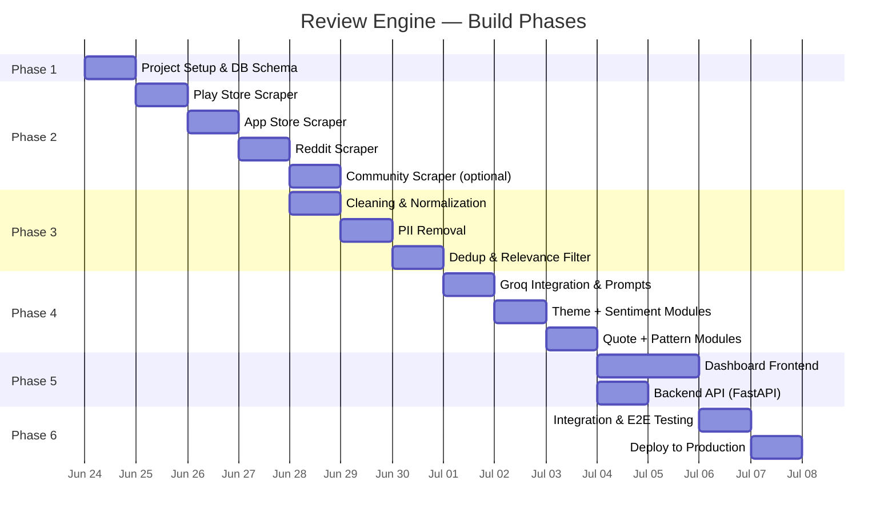
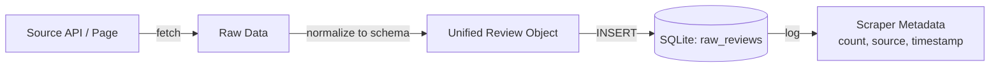
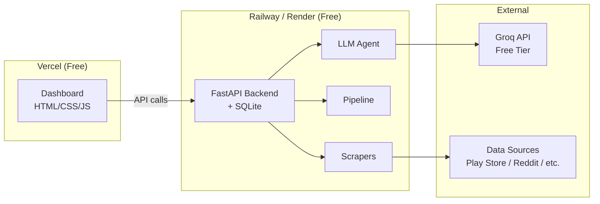

# 📋 Phased Implementation Plan — AI-Powered Review Discovery Engine

> **Scope:** Part 1 of the graduation project (Review Engine only)
>
> **Reference:** [Architecture](architecture.md) · [Problem Statement](problemstatement.md)
>
> **Deadline:** July 6, 2026, 3:59 PM IST

---

## Phase Overview



---

## Folder Structure (Phase-Mapped)

Each phase lives in its own folder within the project root:

```
graduation-project/
├── Docs/
│   ├── problemstatement.md
│   ├── architecture.md
│   └── implementation_plan.md    ← This document
│
├── phase1-setup/                 # Project scaffolding & database
│   ├── config.py
│   ├── db.py
│   ├── requirements.txt
│   └── .env.example
│
├── phase2-scrapers/              # All scraper modules
│   ├── base_scraper.py
│   ├── playstore_scraper.py
│   ├── appstore_scraper.py
│   ├── reddit_scraper.py
│   └── community_scraper.py
│
├── phase3-pipeline/              # Data cleaning & processing
│   ├── cleaner.py
│   ├── pii_remover.py
│   ├── deduplicator.py
│   └── relevance_filter.py
│
├── phase4-agent/                 # LLM analysis modules
│   ├── analyzer.py
│   ├── theme_classifier.py
│   ├── sentiment.py
│   ├── quote_extractor.py
│   ├── pattern_detector.py
│   └── prompts/
│       ├── theme_prompt.txt
│       ├── sentiment_prompt.txt
│       ├── quote_prompt.txt
│       └── pattern_prompt.txt
│
├── phase5-dashboard/             # Frontend + Backend API
│   ├── frontend/
│   │   ├── index.html
│   │   ├── index.css
│   │   └── app.js
│   └── api/
│       └── server.py
│
├── phase6-deploy/                # Deployment configs & integration
│   ├── main.py                   # Full pipeline orchestrator
│   ├── vercel.json
│   └── Procfile
│
├── data/
│   ├── database.sqlite           # SQLite DB (gitignored)
│   └── lexicon/
│       └── discovery_keywords.json
│
├── .env
├── .gitignore
└── README.md
```

---

## Phase 1 — Project Setup & Database Schema

**Folder:** `phase1-setup/`
**Goal:** Scaffold the project, install dependencies, define SQLite schema, set up config management.

### Tasks

| # | Task | Details |
|---|---|---|
| 1.1 | Create project directory structure | All phase folders, `data/`, `Docs/` |
| 1.2 | `requirements.txt` | Pin all dependencies: `google-play-scraper`, `praw`, `beautifulsoup4`, `spacy`, `pandas`, `groq`, `fastapi`, `uvicorn` |
| 1.3 | `config.py` | Centralized config — loads `.env` for API keys, defines constants (batch size, theme taxonomy, rate limits) |
| 1.4 | `.env.example` | Template with `GROQ_API_KEY=`, `REDDIT_CLIENT_ID=`, `REDDIT_CLIENT_SECRET=` |
| 1.5 | `db.py` — SQLite schema | Create tables for raw reviews, processed reviews, and analysis results |

### SQLite Schema

```sql
-- Raw reviews (as scraped)
CREATE TABLE raw_reviews (
    id TEXT PRIMARY KEY,
    source TEXT NOT NULL,          -- play_store | app_store | reddit | community
    rating INTEGER,
    title TEXT,
    text TEXT NOT NULL,
    date TEXT,                     -- ISO 8601
    metadata JSON,                -- thumbs_up, subreddit, reply_count, etc.
    scraped_at TEXT DEFAULT (datetime('now'))
);

-- Processed reviews (after pipeline)
CREATE TABLE processed_reviews (
    id TEXT PRIMARY KEY,
    source TEXT NOT NULL,
    rating INTEGER,
    text TEXT NOT NULL,            -- PII-stripped
    date TEXT,
    word_count INTEGER,
    discovery_keywords JSON,
    engagement_score INTEGER,
    processed_at TEXT DEFAULT (datetime('now'))
);

-- LLM analysis results
CREATE TABLE analysis_results (
    review_id TEXT PRIMARY KEY,
    theme_ids JSON,               -- ["T1", "T3"]
    theme_confidence REAL,
    sentiment TEXT,                -- positive | neutral | negative | frustrated
    sentiment_confidence REAL,
    signal_phrases JSON,
    analyzed_at TEXT DEFAULT (datetime('now')),
    FOREIGN KEY (review_id) REFERENCES processed_reviews(id)
);

-- Aggregated insights (per pipeline run)
CREATE TABLE pipeline_runs (
    run_id TEXT PRIMARY KEY,
    started_at TEXT,
    completed_at TEXT,
    total_raw INTEGER,
    total_processed INTEGER,
    total_analyzed INTEGER,
    themes_summary JSON,
    sentiment_summary JSON,
    top_quotes JSON,
    behavior_patterns JSON,
    status TEXT DEFAULT 'running'  -- running | completed | failed
);
```

### Exit Criteria
- [x] `python db.py` creates `data/database.sqlite` with all 4 tables
- [x] `config.py` loads `.env` values without error
- [x] `requirements.txt` installs cleanly via `pip install -r requirements.txt`

---

## Phase 2 — Scrapers

**Folder:** `phase2-scrapers/`
**Goal:** Build scraper modules for each data source. Each scraper fetches reviews and saves them to the `raw_reviews` table.

### Tasks

| # | Task | Details |
|---|---|---|
| 2.1 | `base_scraper.py` | Abstract base class with `fetch()`, `save_to_db()`, `get_metadata()` interface |
| 2.2 | `playstore_scraper.py` | Uses `google-play-scraper` Python library. Scrape Spotify app reviews (2,000–5,000). Filter by recency. |
| 2.3 | `appstore_scraper.py` | Uses App Store RSS feed or `app_store_scraper`. Scrape across multiple countries (IN, US, UK). 1,000–3,000 reviews. |
| 2.4 | `reddit_scraper.py` | Uses PRAW. Target subreddits: `r/spotify`, `r/Music`, `r/LetMeIntroduceYou`. Fetch posts + top-level comments. 500–1,500 items. |
| 2.5 | `community_scraper.py` *(stretch)* | Uses BeautifulSoup/Playwright. Scrape Spotify Community forum threads tagged with discovery/recommendation topics. |

### Per-Scraper Flow



### Key Implementation Notes
- Each scraper must handle **pagination** — Play Store and Reddit paginate differently
- Implement **exponential backoff** on rate limit errors (429s)
- Reddit requires a registered app for PRAW → credentials go in `.env`
- All scrapers must normalize output to the raw review schema (§2.3 of architecture)
- Add a `--source` CLI flag so scrapers can be run individually: `python playstore_scraper.py`

### Exit Criteria
- [ ] Each scraper runs independently and populates `raw_reviews` table
- [ ] Combined total ≥ 3,000 reviews across at least 3 sources
- [ ] No crashes on rate limits — graceful retry or stop
- [ ] `SELECT COUNT(*) FROM raw_reviews GROUP BY source` shows expected distribution

---

## Phase 3 — Data Pipeline

**Folder:** `phase3-pipeline/`
**Goal:** Clean, strip PII, deduplicate, and filter raw reviews into the `processed_reviews` table.

### Tasks

| # | Task | Details |
|---|---|---|
| 3.1 | `cleaner.py` | Strip HTML, normalize Unicode, standardize dates (ISO 8601), normalize ratings to 1–5, discard empty text, language detect (English only) |
| 3.2 | `pii_remover.py` | Regex pass (emails, phones, URLs with user IDs) + spaCy NER pass (person names, account IDs). Exclude reviews that fail PII check. |
| 3.3 | `deduplicator.py` | Exact dedup via `(source, text_hash)`. Fuzzy dedup via Jaccard similarity (≥ 0.85 threshold). Keep highest-engagement version. |
| 3.4 | `relevance_filter.py` | Keyword pre-filter using `discovery_keywords.json` lexicon. Optional: Groq binary classification for borderline reviews. |

### Pipeline Orchestration

The pipeline runs sequentially — each step reads from the previous step's output:

```
raw_reviews table
    → cleaner.py        (output: cleaned in-memory list)
    → pii_remover.py    (output: PII-stripped list)
    → deduplicator.py   (output: deduplicated list)
    → relevance_filter.py (output: discovery-relevant list)
    → INSERT INTO processed_reviews
```

### Discovery Keywords Lexicon (`data/lexicon/discovery_keywords.json`)

```json
{
  "primary": [
    "discover", "discovery", "Discover Weekly", "Release Radar",
    "recommend", "recommendation", "suggested", "algorithm",
    "new music", "new songs", "new artists", "explore"
  ],
  "secondary": [
    "same songs", "repetitive", "repeat", "boring", "stale",
    "bubble", "loop", "skip", "predictable", "stuck",
    "Daily Mix", "playlist", "radio", "similar artists"
  ]
}
```

A review passes the filter if it contains **≥1 primary keyword** OR **≥2 secondary keywords**.

### Exit Criteria
- [x] `processed_reviews` table populated with cleaned, PII-free, deduplicated, discovery-relevant reviews (453 reviews)
- [x] Review count drops logically through each pipeline step: 5,171 raw → 4,496 cleaned → 4,481 PII-stripped → 4,044 deduped → 453 discovery-relevant
- [x] Spot-check 20 random processed reviews — zero PII, all discovery-related ✓
- [x] Pipeline logs show counts at each step ✓

---

## Phase 4 — LLM Analysis Agent

**Folder:** `phase4-agent/`
**Goal:** Use Groq (Llama 3 70B / Mixtral) to classify themes, analyze sentiment, extract quotes, and detect behavior patterns.

### Tasks

| # | Task | Details |
|---|---|---|
| 4.1 | `analyzer.py` | Main orchestrator — loads processed reviews in batches of ~50, dispatches to each analysis module, aggregates results, saves to `analysis_results` table |
| 4.2 | `theme_classifier.py` | Classify each review into 1–2 themes from T1–T7 taxonomy. Returns JSON with `theme_ids` + `confidence`. |
| 4.3 | `sentiment.py` | 4-class classification: positive / neutral / negative / frustrated. Returns `sentiment`, `confidence`, `signal_phrases`. |
| 4.4 | `quote_extractor.py` | For each theme, select 3–5 best representative quotes (PII-free, high-engagement, source-diverse). |
| 4.5 | `pattern_detector.py` | Cross-corpus pattern detection: workarounds, abandonment triggers, platform comparisons, power-user vs casual splits. |
| 4.6 | Prompt files (`prompts/`) | Craft and iterate on task-specific system prompts for each module. |

### Groq Integration Pattern

```python
from groq import Groq

client = Groq(api_key=config.GROQ_API_KEY)

def classify_batch(reviews: list[dict]) -> list[dict]:
    response = client.chat.completions.create(
        model="llama3-70b-8192",        # Primary model
        messages=[
            {"role": "system", "content": THEME_SYSTEM_PROMPT},
            {"role": "user", "content": json.dumps(reviews)}
        ],
        temperature=0.2,
        max_tokens=2000,
        response_format={"type": "json_object"}
    )
    return json.loads(response.choices[0].message.content)
```

### Batch Processing Strategy

| Factor | Value |
|---|---|
| **Batch size** | ~50 reviews per LLM call |
| **Estimated batches** | ~50 batches (for 2,500 processed reviews) |
| **Tasks per batch** | 2 (theme + sentiment combined in one call to reduce API calls) |
| **Quote extraction** | Run once per theme (7 calls total), not per review |
| **Pattern detection** | Run once on full corpus summary (1 call) |
| **Total estimated API calls** | ~60 calls |
| **Groq free tier** | 30 req/min, 14,400 req/day — **well within limits** |

### Exit Criteria
- [ ] `analysis_results` table fully populated with theme + sentiment for every processed review
- [ ] Theme distribution aggregated (counts + percentages per theme)
- [ ] 3–5 quotes extracted per theme (21–35 total)
- [ ] Behavior patterns summary generated (JSON)
- [ ] `pipeline_runs` table updated with full aggregated summary

---

## Phase 5 — Dashboard & API

**Folder:** `phase5-dashboard/`
**Goal:** Build an interactive frontend + lightweight FastAPI backend that renders the insights and allows the evaluator to trigger the pipeline.

### Tasks

| # | Task | Details |
|---|---|---|
| 5.1 | `api/server.py` — FastAPI backend | Endpoints: `/api/run-pipeline`, `/api/status`, `/api/insights`, `/api/insights/themes`, `/api/insights/sentiment`, `/api/insights/quotes`, `/api/insights/patterns`, `/api/meta` |
| 5.2 | `frontend/index.html` | Dashboard layout — summary stats, theme chart, sentiment chart, quotes panel, patterns panel, research questions checklist |
| 5.3 | `frontend/index.css` | Spotify-inspired dark theme. Premium design — glassmorphism cards, smooth gradients, Inter/Outfit typography. |
| 5.4 | `frontend/app.js` | Fetch insights from API, render charts (Chart.js or vanilla SVG), populate quote cards, handle Run button with status polling. |

### API Endpoints (from Architecture §9)

| Method | Endpoint | Response |
|---|---|---|
| `POST` | `/api/run-pipeline` | `{ "run_id": "...", "status": "running" }` |
| `GET` | `/api/status` | `{ "status": "analyzing", "progress": "65%" }` |
| `GET` | `/api/insights` | Full insight JSON payload |
| `GET` | `/api/insights/themes` | `[{ "id": "T1", "name": "...", "count": 1185, "pct": 28.0 }]` |
| `GET` | `/api/insights/sentiment` | Sentiment breakdown by theme |
| `GET` | `/api/insights/quotes?theme=T1` | Quotes for a specific theme |
| `GET` | `/api/insights/patterns` | Behavior pattern narratives |
| `GET` | `/api/meta` | Corpus metadata |

### Dashboard Design Principles
- **Dark theme** inspired by Spotify's visual language (dark bg, green accents `#1DB954`)
- **Glassmorphism cards** for each insight section
- **Chart.js** for theme distribution (horizontal bar) and sentiment (doughnut)
- **Micro-animations** — fade-in on load, smooth transitions on data update
- **Run button** with real-time status indicator (scraping → processing → analyzing → complete)
- **Mobile responsive** — single column on small screens

### Exit Criteria
- [ ] Dashboard loads and renders pre-existing insight data
- [ ] Run button triggers full pipeline and updates dashboard when complete
- [ ] Theme chart, sentiment chart, quotes, and patterns all render correctly
- [ ] Status indicator shows pipeline progress in real-time
- [ ] Passes basic visual QA — no broken layouts, readable text, professional appearance

---

## Phase 6 — Integration, Testing & Deployment

**Folder:** `phase6-deploy/`
**Goal:** Wire everything together, test end-to-end, and deploy to production.

### Tasks

| # | Task | Details |
|---|---|---|
| 6.1 | `main.py` — Pipeline orchestrator | Single entry point that chains: scrapers → pipeline → agent → output. Can be triggered via CLI or API. |
| 6.2 | End-to-end test | Run full pipeline from scratch. Verify: raw → processed → analyzed → dashboard renders. |
| 6.3 | Edge case handling | Empty source, API timeout, malformed review, Groq rate limit — graceful error handling throughout. |
| 6.4 | Deploy backend | Railway or Render (free tier). FastAPI backend serving API endpoints. |
| 6.5 | Deploy frontend | Vercel (free tier). Static dashboard connected to deployed backend. |
| 6.6 | README.md | Setup instructions, architecture overview, live link, how to test, known limitations. |
| 6.7 | Final validation | Evaluator walkthrough — click Run, observe pipeline, verify insights appear. |

### Deployment Architecture



### Exit Criteria
- [ ] Live URL accessible — dashboard loads
- [ ] Run button triggers pipeline on deployed backend
- [ ] Full pipeline completes without errors
- [ ] Insights render on dashboard after pipeline completion
- [ ] README has setup instructions and live link
- [ ] Total cost: **$0**

---

## Timeline Summary

| Phase | What | Est. Duration | Target Completion |
|---|---|---|---|
| **Phase 1** | Setup & DB Schema | 1 day | June 24 |
| **Phase 2** | Scrapers (3–4 sources) | 3–4 days | June 28 |
| **Phase 3** | Data Pipeline | 2–3 days | June 30 |
| **Phase 4** | LLM Analysis Agent | 2–3 days | July 2 |
| **Phase 5** | Dashboard & API | 2–3 days | July 4 |
| **Phase 6** | Integration & Deploy | 1–2 days | July 5 |
| **Buffer** | Bug fixes, polish | 1 day | **July 6 (deadline)** |

---

## Risk Mitigation

| Risk | Mitigation |
|---|---|
| **Play Store / App Store scraping blocked** | Fall back to RSS feeds or pre-exported CSV datasets |
| **Reddit API rate limits** | Use Reddit JSON endpoints (no auth needed) as fallback; cache aggressively |
| **Groq free tier exceeded** | Reduce batch size, combine theme + sentiment into single prompt, use Mixtral (cheaper) for simpler tasks |
| **Spotify Community hard to scrape** | Mark as stretch goal — 3 sources minimum is sufficient |
| **spaCy NER too heavy for deployment** | Use regex-only PII removal for deployed version; NER for local processing |
| **Deployment platform issues** | Have Railway and Render as alternatives; both have free tiers |
