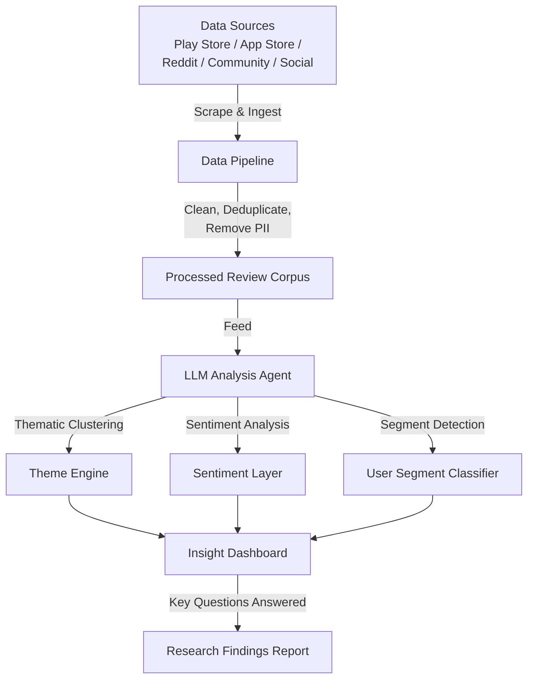

# 🎵 Spotify AI-Powered Music Discovery Engine — Problem Statement

## 1. Background & Context

Spotify is one of the world's largest audio streaming platforms, serving hundreds of millions of users across 180+ markets. The platform has successfully built one of the most sophisticated recommendation systems in the industry, powered by collaborative filtering, content-based models, and deep learning. Features like Discover Weekly, Release Radar, and Daily Mix have become industry benchmarks.

However, a significant portion of listening still comes from **repeat playlists, familiar artists, and previously discovered tracks**. Despite the algorithmic sophistication, users frequently fall into "listening loops" — a pattern where the recommendation engine reinforces existing preferences rather than meaningfully expanding musical horizons. This creates a self-reinforcing feedback cycle:

- Users play familiar tracks → algorithm learns the preference → recommends similar tracks → user stays in the same sonic bubble.

One of Spotify's strategic goals is to **increase meaningful music discovery and reduce repetitive listening behavior.** Meaningful discovery is not simply surfacing unfamiliar content — it is surfacing *new music that is genuinely relevant, resonant, and valued by the user*. Recommending Punjabi songs to a user who has never shown interest in that genre is discovery, but it is not meaningful discovery.

This project addresses the challenge across **four interconnected parts**: building an AI-powered review analysis engine, validating findings through primary user research, defining the problem with precision, and deploying an AI-native MVP that demonstrates why AI is uniquely suited to solving this problem.

---

## 2. Objective

Design and build a full-stack, AI-native solution that:

1. **Analyzes user feedback at scale** — An AI-powered review discovery engine that ingests, processes, and surfaces actionable insights from App Store reviews, Play Store reviews, Reddit discussions, Spotify community forums, and social media conversations.
2. **Validates insights through primary research** — Conducts 5–6 structured user interviews with respondents belonging to the chosen target segment to confirm or challenge AI-generated findings.
3. **Defines the problem with depth** — Clearly articulates the root cause, the target user segment (by use case, not demographics), and the business rationale for solving it.
4. **Ships an AI-native MVP to production** — A deployed, interactive prototype (feature within Spotify's product or a standalone agent) that demonstrates what AI uniquely unlocks that traditional recommendation systems cannot.

---

## 3. Core Problem

### 3.1 Why Traditional Recommendations Are Insufficient

Spotify's current recommendation engine excels at pattern matching within a user's established preferences. However, it fundamentally struggles with:

- **Filter Bubble Reinforcement:** Collaborative filtering optimizes for engagement with familiar patterns. It does not incentivize exploration beyond the user's established taste profile.
- **Cold-Start for Exploration:** When a user has deep listening history in one genre, the algorithm has no strong signal to determine *which* unfamiliar genre or artist might resonate — resulting in irrelevant or low-quality discovery attempts.
- **Passive Discovery Only:** Current discovery features (Discover Weekly, Radio) are algorithmically curated without user agency. Users cannot articulate *what kind* of new music they want to discover — there is no mechanism for intent-driven exploration.
- **Context Blindness:** Recommendations do not adapt to situational contexts (e.g., a user who listens to focus music while working might want energetic discovery during a workout, but the algorithm cannot distinguish these modalities without explicit signals).

### 3.2 What AI Uniquely Unlocks

AI (specifically LLMs and agentic workflows) can address these gaps in ways traditional recommendation systems cannot:

- **Conversational Intent Capture:** Instead of inferring preferences from passive listening data alone, an LLM can engage users in natural dialogue to understand *what they mean* by "something new" — whether it's a new genre, a new era of music, an underrated artist in a familiar genre, or a mood they've never explicitly searched for.
- **Contextual Reasoning:** LLMs can reason across multiple signals simultaneously — time of day, recent listening patterns, explicitly stated moods, and cultural context — to generate discovery suggestions that feel personally meaningful rather than algorithmically generic.
- **Explanation & Trust:** Unlike black-box collaborative filtering, an LLM can explain *why* a particular track or artist is being recommended, building user trust and willingness to explore.
- **Dynamic Exploration Paths:** AI can create adaptive, multi-step discovery journeys (e.g., "Start with this familiar artist → bridge to this adjacent artist → explore this new genre") rather than isolated single-track recommendations.

---

## 4. Target User Segment

### 4.1 Segmentation Approach — Use-Case Driven

Segmentation for this project must be **use-case driven, not demographic-driven**. Age, income, and geography are not the primary axes along which music discovery needs vary. Instead, the critical segmentation axis is **how and why users listen to music**, and specifically, **how their discovery behavior manifests**.

Users interact with Spotify across fundamentally different use cases:

| Use Case | Listening Behavior | Discovery Challenge |
|---|---|---|
| **Focused/Ambient Listening** | Background music for work, study, sleep | Users want consistency, not disruption — discovery must be subtle |
| **Active Exploration** | Dedicated sessions to find new music | Users want high-signal suggestions, not more of the same |
| **Social/Shared Listening** | Playlists for parties, road trips, group settings | Discovery is filtered through group dynamics |
| **Mood-Driven Listening** | Music selected by emotional state | Algorithm misreads mood → recommends wrong "new" music |
| **Identity/Taste-Building** | Curating a personal library as self-expression | Users want to discover artists that align with a self-image |

### 4.2 Chosen Segment

> **Primary Segment:** Active explorers who have built deep listening histories in specific genres and explicitly want to expand their musical taste — but repeatedly fail to find meaningful new music through existing Spotify features.

This segment is defined not by age or profession, but by a **specific behavioral pattern and unmet need:**

- They have used Discover Weekly / Release Radar consistently for 6+ months
- They report a high skip rate on recommended tracks
- They have expressed frustration (in reviews, forums, or interviews) that recommendations feel "stale" or "predictable"
- They are *willing* to invest time in discovery — the problem is not apathy but inadequate tooling

### 4.3 Segment Size & Business Case

- Spotify reports 250M+ paid subscribers globally. Public data and community analysis suggest that engaged, exploration-oriented listeners represent a meaningful subset — estimated at 15–25% of premium users based on listening pattern analysis.
- Users who successfully discover new music show higher retention, increased session length, and greater willingness to maintain premium subscriptions — directly impacting Spotify's core revenue metrics.
- Reducing listening loop behavior also benefits Spotify's marketplace model by distributing streams more equitably across the long tail of artists.

---

## 5. Part 1 — AI-Powered Review Discovery Engine

### 5.1 Purpose

Before proposing any solution, systematically analyze user feedback at scale to understand:

- Why do users struggle to discover new music on Spotify?
- What are the most common frustrations with the recommendation engine?
- What listening behaviors are users trying to achieve but failing at?
- What causes users to repeatedly listen to the same content?
- Which user segments experience different discovery challenges?
- What unmet needs emerge consistently across review sources?

### 5.2 Data Sources

| Source | Rationale |
|---|---|
| **Google Play Store Reviews** | Highest volume of structured user feedback; filterable by recency and rating |
| **Apple App Store Reviews** | Captures iOS-specific user experience and a different demographic cross-section |
| **Reddit (r/spotify, r/Music, r/LetMeIntroduceYou)** | Long-form, nuanced user discussions about discovery frustrations |
| **Spotify Community Forums** | Official channel where users report specific feature feedback and discovery issues |
| **Twitter/X Conversations** | Real-time sentiment and viral frustration patterns |

### 5.3 System Architecture

### 5.4 Analysis Requirements

The review engine must:

- **Ingest and process** reviews from at least 3 of the listed sources
- **Thematically categorize** feedback into ≤ 7 discovery-related themes (e.g., *Algorithm Staleness, Genre Bubble, Skip Fatigue, Context Mismatch, Playlist Decay, Feature Gap, Exploration Fatigue*)
- **Surface representative user quotes** for each theme (PII-stripped)
- **Detect patterns** in how discovery frustrations vary across user behavior types
- **Quantify sentiment distribution** across themes (positive / neutral / negative / frustrated)
- Be **testable end-to-end** — the evaluator should be able to trigger the workflow, observe data fetching, and see the generated insights

### 5.5 Deliverable

A working, testable link (deployed tool, GitHub repo with README and demo, or interactive workflow) demonstrating the full scrape → analyze → insight pipeline, along with a 1-slide summary in the final deck outlining how the system works.

---

## 6. Part 2 — User Research Validation

### 6.1 Purpose

AI-generated insights are a starting point, not a conclusion. Primary research must validate, challenge, or deepen the findings from the review analysis engine.

### 6.2 Approach

- Conduct **5–6 structured user interviews** with respondents belonging to the chosen segment (active explorers frustrated with discovery)
- Interview respondents should be screened using a qualifying survey to confirm they match the behavioral criteria (regular Spotify usage, attempted discovery, experienced dissatisfaction)
- Interview questions should probe:
  - Specific moments of discovery failure ("Tell me about the last time you tried to find new music on Spotify and gave up")
  - Workarounds they've adopted (external playlists, TikTok, friend recommendations, Shazam)
  - Mental models around what "good" discovery looks like
  - Trust levels in algorithmic vs. human vs. AI-explained recommendations

### 6.3 Research Output

- Synthesis of key findings mapped against the AI-engine themes
- Confirmation, contradiction, or nuance added to each theme
- Identification of the **root cause** driving the core discovery problem
- Data (qualitative) that substantiates the chosen direction

---

## 7. Part 3 — Problem Definition

### 7.1 Problem Frame

Based on the combined insights from Part 1 (AI review analysis) and Part 2 (user interviews), the problem must be defined with precision:

- **Who** is affected? → The specific user segment, described by behavior and use case
- **What** is the core problem? → The root cause, not the surface symptom
- **Why** does it matter? → The business impact of leaving this unsolved (churn risk, revenue impact, marketplace imbalance)
- **Why now?** → Why AI makes this solvable today when it wasn't before

### 7.2 Business Justification

The problem definition must connect to measurable business outcomes:

- **Retention Impact:** Users who successfully discover new music are X% more likely to retain their premium subscription
- **Engagement Lift:** Meaningful discovery sessions lead to longer session times and higher DAU/MAU ratios
- **Marketplace Health:** Distributing discovery across more artists improves Spotify's value proposition to creators and labels
- **Competitive Positioning:** Competitors (Apple Music, YouTube Music, Amazon Music) are investing heavily in AI-driven personalization — Spotify must maintain its discovery leadership

---

## 8. Part 4 — AI-Native MVP

### 8.1 Requirements

The MVP must be:

- **Deployed to production** — accessible via a live link (not a Lovable link or local-only demo)
- **Interactive** — the evaluator should be able to use the prototype and understand the user flow
- **Iterated** — showing clear evidence of design refinement (not a one-shot generation)
- **AI-native** — demonstrating why AI is uniquely suited to solving this problem (not a traditional feature that could exist without AI)

### 8.2 Solution Criteria

The solution will be evaluated at three levels:

| Level | Criteria | Question |
|---|---|---|
| **L1: Problem-Solution Fit** | Does the solution address the identified problem? | Is there a clear, logical connection between the research-backed problem and the proposed solution? |
| **L2: Differentiation** | Is the solution differentiated from what exists? | Does this solution do something that Spotify's current features and competitors' products do not? |
| **L3: Competitive Advantage** | Is there a defensible moat? | Is this solution difficult for a competitor to replicate overnight? What makes it uniquely sustainable? |

### 8.3 What the MVP Must Demonstrate

- Why traditional recommendation systems (collaborative filtering, content-based) are insufficient for this specific problem
- What AI (LLMs, agentic workflows, contextual reasoning) unlocks that was previously difficult or impossible
- How AI fundamentally changes the user experience of music discovery — not just incrementally improves it

### 8.4 Prototype Quality Standards

- Brand-aligned visual design (matching Spotify's design language where applicable)
- Clear, polished copy — not AI-generated boilerplate
- Thoughtful UX that demonstrates iteration and user-centricity
- Functional interactions that communicate the core value proposition

---

## 9. Metrics & Evaluation Framework

### 9.1 Product Metrics

| Metric | What It Measures |
|---|---|
| **Discovery Conversion Rate** | % of recommended tracks that are saved, added to playlist, or listened to fully |
| **Skip Rate on Discovery** | % of AI-surfaced recommendations that are skipped within 10 seconds |
| **Discovery Session Depth** | Average number of new artists/tracks explored per discovery session |
| **Repeat Listening Ratio Shift** | Change in the ratio of familiar vs. new content in a user's weekly listening |
| **30-Day Retention Lift** | Retention delta between users exposed to the feature vs. control group |

### 9.2 AI Evaluation Metrics

| Metric | What It Measures |
|---|---|
| **Recommendation Relevance Score** | User-rated relevance of AI-surfaced tracks (1–5 scale) |
| **Explanation Quality** | User perception of how helpful/accurate the AI's reasoning is for why a track was recommended |
| **Intent Alignment Accuracy** | % of cases where the AI correctly interpreted the user's stated exploration intent |
| **Hallucination Rate** | % of recommendations where the AI fabricates artist/track metadata or misattributes characteristics |
| **Diversity Index** | Entropy measure of genre/artist diversity in AI recommendations vs. baseline |

---

## 10. Key Constraints

| Constraint | Details |
|---|---|
| **Public Data Only** | Review scraping must use publicly accessible sources — no login-walled or private API data |
| **Zero PII Leakage** | No user names, email addresses, device identifiers, or account details in any output |
| **Slide Deck** | 10-slide maximum, minimum font size 14pt (Google Slides/PPT), descriptive slide titles conveying the key message |
| **Deployment** | MVP must be deployed to production and accessible via a shareable link |
| **Original Thinking** | All analysis, problem framing, and solution rationale must reflect authentic thought — defensible in an interview setting |
| **Submission Deadline** | July 6, 2026, 3:59 PM IST — no extensions |

---

## 11. Deliverables Summary

| # | Deliverable | Format |
|---|---|---|
| 1 | AI-Powered Review Analysis Engine | Live testable link (deployed tool / GitHub repo with demo) |
| 2 | Review Engine Architecture Summary | 1 slide within the final deck |
| 3 | Slide Deck (full project narrative) | PDF, ≤ 10 slides |
| 4 | AI-Native MVP / Prototype | Live deployed link (production) |

---

## 12. Guiding Principles

1. **Be problem-led, not solution-led.** The depth of problem understanding is the primary differentiator — not the sophistication of the solution.
2. **Segment by use case, not demographics.** Understand *how* users listen and *what* they're trying to achieve — not their age or profession.
3. **Let data drive decisions.** Every segment choice, problem prioritization, and solution direction must be backed by qualitative or quantitative evidence.
4. **Build defensible solutions.** The solution should have a clear competitive advantage that cannot be trivially replicated.
5. **Tell a compelling story.** If the 10 slide titles alone convey the full narrative arc, the storytelling is right.
6. **Critique your own work.** Identify ways your solution can fail, edge cases, and open questions — this demonstrates depth.
7. **Ship to production.** A deployed, iterated prototype demonstrates capability — a mockup does not.
