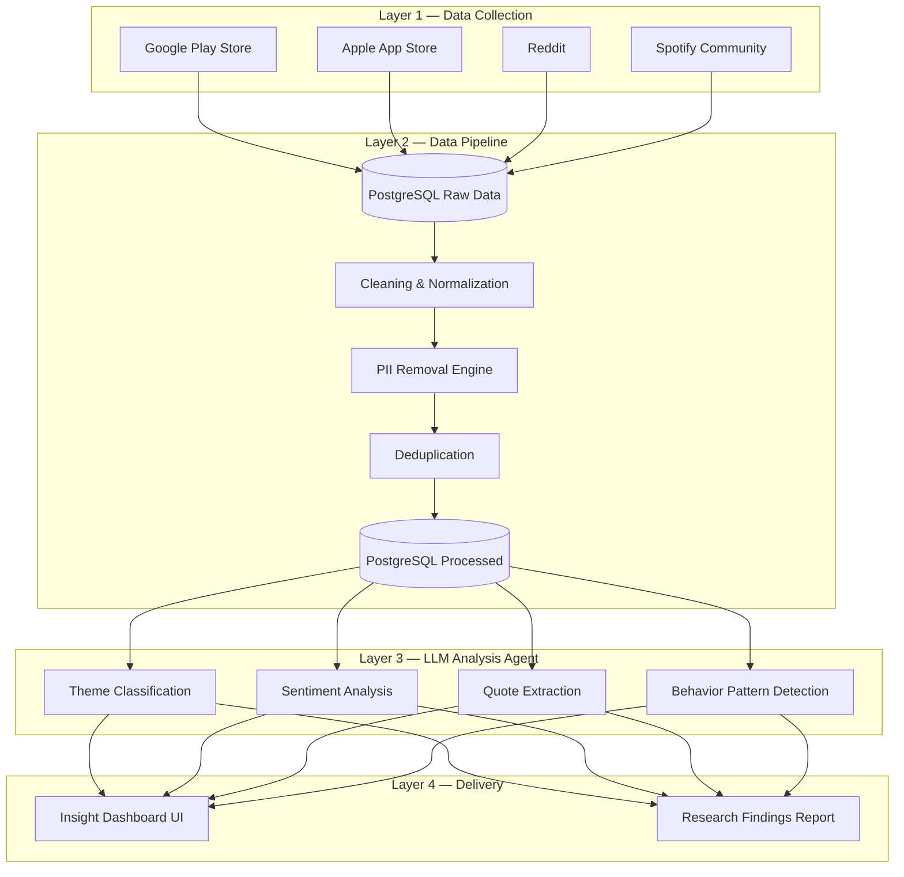

# 🎵 Spotify Review Discovery Engine

An end-to-end **AI-Powered Review Analytics Engine** built to scrape, process, and analyze user feedback across multiple platforms to extract actionable product insights regarding Spotify's music discovery features.

---

## 📌 Project Overview

This project is a continuous, automated feedback loop that proactively discovers what users are saying "in the wild" about their Spotify experience. Instead of relying on lagging manual user surveys, this engine automatically identifies workarounds, abandonment triggers, and friction points.

It scrapes thousands of reviews from Reddit, the Apple App Store, the Google Play Store, and the Spotify Community forums. It then utilizes a multi-model LLM architecture (Google Gemini and Groq) to:
- Strip Personal Identifiable Information (PII)
- Classify reviews into specific pain-point themes
- Analyze sentiment and user frustration levels
- Extract highly representative user quotes
- Detect overarching behavioral patterns

---

## 🏗️ Architecture & Data Pipeline

The engine relies on a headless, scheduled GitHub Actions pipeline that feeds a centralized PostgreSQL database. All heavy data processing occurs in the background, ensuring the insight dashboard remains blazing fast.

---

## 🧠 Strategic Highlights

### 1. Aggressive Relevance Filtering
Feeding raw scraped data to LLMs is expensive and inefficient. We built a strict NLP relevance filter that drops **91.3%** of "noise" (e.g., spam, "great app"). The AI only spends compute time on reviews containing actual friction points, maximizing insight density and minimizing API costs.

### 2. Multi-Model LLM Architecture
- **Groq (Llama 3 70B):** Utilized for rapid, high-volume categorization tasks where latency is critical.
- **Google Gemini (2.5 Flash):** Utilized for complex nuance extraction, including pulling out behavioral workarounds, analyzing deep sentiment, and extracting exact user quotes.

### 3. Headless Execution
Originally, the dashboard featured a "Run Pipeline" button that would hang the UI during scraping and analysis. This architecture shifts the heavy lifting to run headlessly via a scheduled **GitHub Actions** pipeline. The UI is now instantly responsive, querying pre-processed insights directly from PostgreSQL.

### 4. Zero PII Tolerance
The data pipeline includes a dual-pass PII removal process (Regex + NER via spaCy). Any review that cannot be confidently stripped of personal identifiers is excluded from the dataset entirely.

---

## 📊 By The Numbers (Latest Pipeline Run)

During the most recent end-to-end automated pipeline run, the system processed:
- **Total Raw Reviews Scraped:** `5,421`
- **Relevance Drop Rate:** `91.3%`
- **PII Items Redacted:** `484` 
- **High-Quality Processed Reviews Analyzed:** `469` 
- **Source Breakdown:** App Store (`60.3%`), Play Store (`24.7%`), Reddit (`14.9%`)

---

## 🛠️ Tech Stack

### Data & Backend
* **Database:** PostgreSQL (Supabase) 
* **Scraping:** Python (PRAW, google-play-scraper)
* **Pipeline:** Python, spaCy (NER for PII), pandas

### AI & LLMs
* **Models:** Google Gemini 2.5 Flash, Groq (Llama-3.3-70b-versatile)
* **Tasks:** Sentiment Analysis, Theme Classification, Quote Extraction, Behavior Pattern Detection

### Frontend & Automation
* **Dashboards:** HTML5, CSS3 (Glassmorphism, Light/Dark Modes), Vanilla JS
* **Automation:** GitHub Actions (Nightly Data Pipeline)

---
*Created as part of the NextLeap PM Fellowship Graduation Project (Part 1).*
