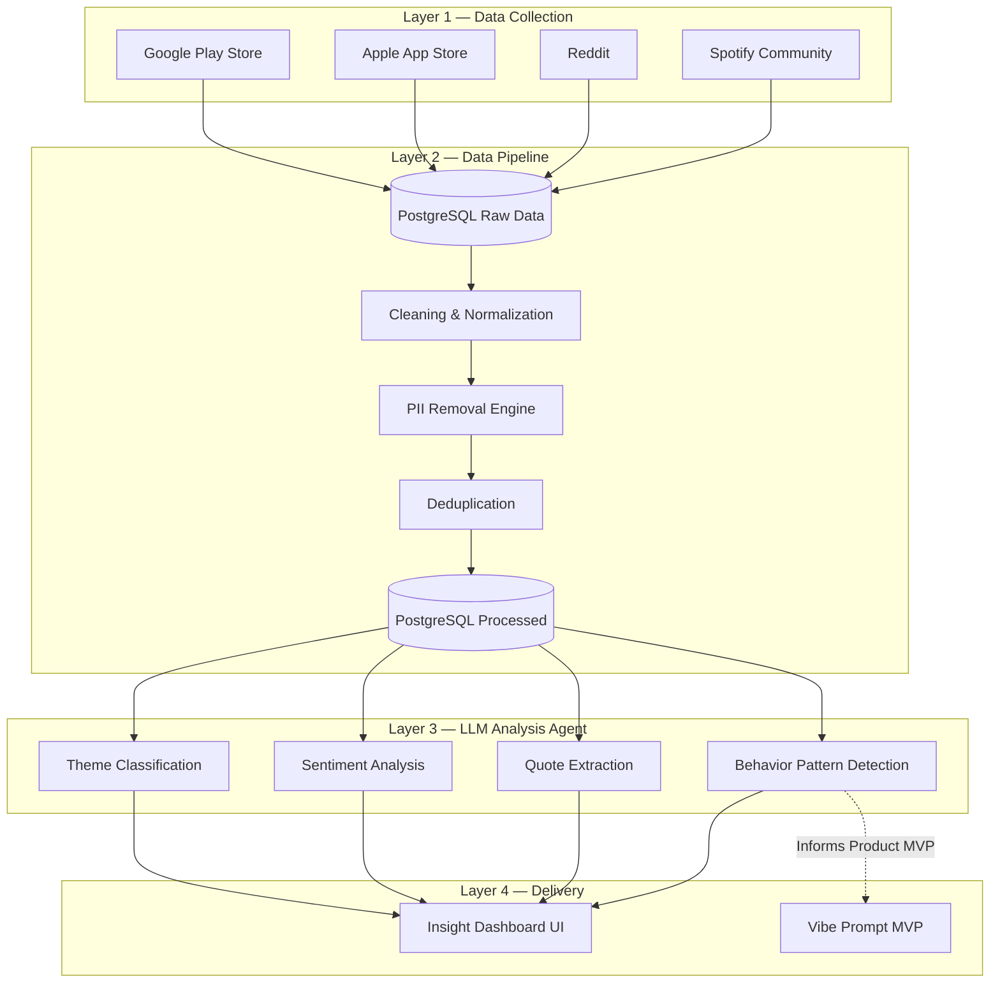

# 🎵 Spotify Review Discovery Engine & AI Vibe Prompt

An end-to-end **AI-Powered Review Analytics Engine** and **Music Discovery MVP (Vibe Prompt)** built to analyze user feedback, extract actionable product insights, and solve music discovery loops on Spotify.

---

## 📌 Project Overview

This project is divided into two major components:
1. **The Review Discovery Engine:** A continuous, automated feedback loop that scrapes thousands of reviews from Reddit, the App Store, the Play Store, and Spotify Community. It uses a multi-model LLM architecture (Gemini + Groq) to strip PII, classify themes, analyze sentiment, and extract user pain points about music discovery.
2. **The Vibe Prompt MVP:** A production-deployed, stateless AI bridge that takes a user's natural language vibe description (e.g., *"late night drive, melancholic but calm"*) and curates a personalized Spotify playlist instantly, solving the exact discovery fatigue identified by the Review Engine.

---

## 🏗️ How It Works (The Data Pipeline)

The engine relies on a headless, scheduled GitHub Actions pipeline that feeds a centralized PostgreSQL database. The heavy lifting is done in the background so the frontend dashboard remains blazing fast.

---

## 🧠 Strategic Highlights

### 1. Aggressive Relevance Filtering
Feeding raw scraped data to LLMs is expensive and inefficient. We built a strict NLP relevance filter that drops **91.3%** of "noise" (e.g., spam, "great app"). The AI only processes reviews containing actual friction points, maximizing insight density and minimizing compute cost.

### 2. Multi-Model LLM Architecture
- **Groq (Llama 3 70B):** Used for rapid, high-volume categorization tasks where latency matters.
- **Google Gemini:** Used for complex nuance extraction (pulling out behavioral workarounds, deep sentiment, and exact user quotes).

### 3. Automated User Research
Instead of lagging manual surveys, this Engine creates a **continuous, automated feedback loop** running in the background via GitHub Actions, giving product teams a massive competitive advantage.

### 4. Zero-Cost Vibe MVP
The Vibe Prompt MVP uses a completely stateless architecture (`Node.js/Express` on Railway + Vercel Frontend + Groq + Spotify Web API) to generate and save playlists directly to a user's Spotify account, proving the research hypothesis at zero infrastructure cost.

---

## 📊 By The Numbers (Latest Run)
- **Total Raw Reviews Scraped:** `5,421`
- **Relevance Drop Rate:** `91.3%`
- **PII Items Redacted:** `484` (Zero PII tolerance)
- **High-Quality Processed Reviews:** `469` 
- **Source Breakdown:** App Store (`60.3%`), Play Store (`24.7%`), Reddit (`14.9%`)

---

## 🛠️ Tech Stack

### Data & Backend
* **Database:** PostgreSQL (Supabase) / SQLite (Local)
* **Scraping:** Python (PRAW, google-play-scraper)
* **Pipeline:** Python, spaCy (NER for PII), pandas
* **Vibe Backend:** Node.js, Express, Axios

### AI & LLMs
* **Models:** Google Gemini 2.5 Flash, Groq (Llama-3.3-70b-versatile)
* **Tasks:** Intent Extraction, Sentiment Analysis, Theme Classification, PII validation

### Frontend & Deployment
* **Dashboards:** HTML5, CSS3 (Glassmorphism, Dark/Light modes), Vanilla JS
* **Hosting:** Vercel (Frontend), Railway (Node.js Backend)
* **Automation:** GitHub Actions (Nightly Data Pipeline)

---
*Created as part of the NextLeap PM Fellowship Graduation Project.*
